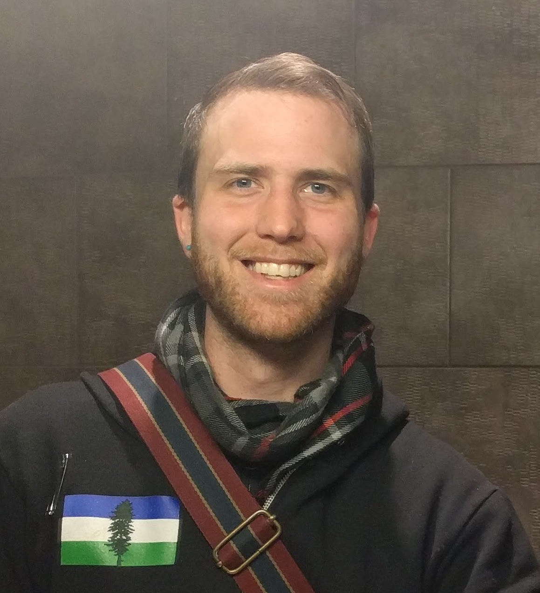

# keneucker

Hello, my name is Ken Eucker. I love to design applications, write poetry, ride my bicycle, hike to hot springs, backpack through canyons, take candid photographs, and talk about the intersection of technology and psychology.

## How to find me
I live in Portland, Oregon and work in the downtown area while bike commuting.

On the internet I keep things pretty simple and use my first and last name most places, so I've got http://keneucker.com as a general landing page, but if you're looking for me elsewhere try my name.

I'm also here:
https://github.com/KenEucker

https://www.linkedin.com/in/keneucker/

https://plus.google.com/u/0/+KennethEucker

https://www.instagram.com/keneucker/

## How to contact me
Send me an email: hello@keneucker.com
Call me or message me elsewhere.
Wave to me.

## How to approach me
I work well with direct communication and honesty, and also with asynchronous communication. Direct messages and emails allow me to prioritize my present moment and gives me an opportunity to respond at a time when my full attention can be given to the conversation. If you can, please let me know; what you have, what you are looking to achieve, how I can help, and any expectations you might have for my response. I am often focused and intentional in how I go about my day so a laugh, walk around the block, or nice chat over a meal is a welcomed opportunity to get to know me better.

## How I can help
I really enjoy helping people become more efficient at what they are doing and providing solutions for people when they have an idea of what they want with what they have. Software Engineering projects aside, I also like to make myself available to actively participate in my community and environment. I think it's important to have support roles in every group and am a willing volunteer for most positions both in a professional and personal capacity. I make a good second in command and an even better self starting laborer. 

I think collaboration and communication are the best ways to accomplish a task with others and I have found a lot of success in talking through my thought process with others. We're all in this together.

## How I spend my time
My schedule changes a lot with the seasons, but there are several constants to how I spend my time. One of those constats is riding my bicycle. I bike commute and travel with a backback and two waterbottles in the summertime, and I bike commute in the winter with raingear and two panniers. I like to ride for fun, for errands, with groups, and totally alone. 

I also like to be out in the woods on trails, campsites, near mountains, and on rivers. I like to sit and stare at viewpoints high and low while having philisophical conversations about everything in life from feelings to adventures to technology and the study of all things. I like to work on crafts, tinker with electronis, and build things out of wood or metal or glass or ceramic.

I also spend a lot of time on my computer when I'm not out and about, creating software solutions for problems big and small or non-existant at all. Web development is a lot of fun and I'll create new websites regularly without much thought. My career is important to me and I spend a lot of time discovering new platforms and programming techniques in order to grow my skills and knowledge. I find my work to be rewarding, creative, and inspiring in a lot of ways.
